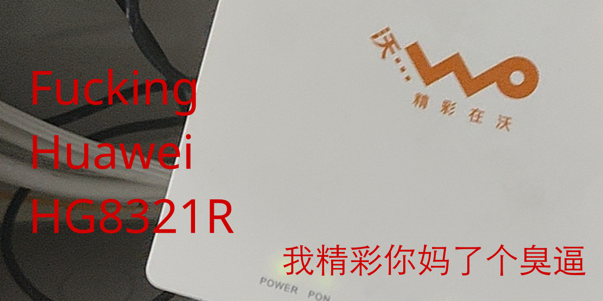

# Fucking Huawei HG8321R

通过**使能**破解华为HG8321R光猫打开Telnet突破超管限制。

**本教程以及其包含的固件、工具所有人可免费下载，完全开源，开源协议遵照 [CC-BY-NC-SA 4.0](https://creativecommons.org/licenses/by-nc-sa/4.0/deed.zh)**

其意思为“知识共享-署名-非商业性-相同方式共享，即此教程共享，转发**必须注明作者本人**-**不允许以各种方法拿此教程获利**

此共享协议对**中国大陆**有效，受**中国法律**保护！用本教程获利的人，我将保留依法追责的权力！

# 前言

首先，为了致敬最后一次更新四年前的[2879597772/ONT](https://github.com/2879597772/ONT)仓库的作者**开放**理念，我也来diss一波。

以下列表里的机构，**母亲全部一声倒地**

- 工信部
- 中国联通
- 恩山论坛
- [宽带技术网](https://chinadsl.net)

前两个机构为什么上似母亲清单不用多说，后面两个他妈的要么不全面要么全在封死资源下载要么就删被管理帖子差不多得了😅😅😅

> ##### 在此diss【宽带论坛】【恩山无线】
>
> 两大坑害换光猫用户的论坛
>
> 各种资源全部被这两大论坛封锁，用户上传的固件教程被这些论坛管理员删除，拿去售卖
>
> 把其他用户摸索出来后分享的教程，转身删除，拿去咸鱼售卖
>
> 请问你们要脸吗？不！你们没有脸！
>
> 你们只想着赚用户的钱，甚至还在论坛发着错误教程让别人变砖，还口口声声的在论坛说帮别人修砖不值得，不“浪费时间”
>
> 现实是你们咸鱼的救砖交易量可观，随便帮忙“下发”一次收费就是三四十，这就是你们口中的“不浪费时间”修砖、“没空”，真可谓是滑天下之大稽
>
> 
>
> ——https://github.com/2879597772/ONT

其次，我也希望社区能研究出别的被[RMS远程下发修改](https://v2ex.com/t/1009610)的光猫的抢救破解的方法，方便其他型号的用户破解。

> ·此教程目的是为了避开【宽带论坛】【恩山无线】那些无良管理和商家，把一些简单问题，他人解决后分享的问题收费化
>
> ·如果你也对折腾光猫有兴趣，有意发类似教程，有意分享您的换猫经验，手上有工具或固件愿意分享出来，请在“issues”发表出来，我将注明您的信息并发表出来
>
> ·此教程可能看到、发现的人并不多，但是，一个人看到就可以帮助一个人！
>
> 
>
> ——https://github.com/2879597772/ONT

# 正文

## 注意

1. 本文章依旧在活跃更新 - 2024/1/22（为了方便小白查看时间不用跑到commit去看）

2. 本项目使用的机器是联通版本的华为HG8321R，版本是V3

## 准备工作

本仓库所有文件和Telnet连接工具（比如[Putty](https://www.putty.org/)）

## 简要总结步骤

（点击链接直接查看对应步骤的详细做法）

1. 拔掉光纤，网口插电脑上
2. [使用使能打开Telnet](enable-telnet.md)
3. [提取当前光猫的配置文件获取宽带账号密码和LOID以及VLAN ID（很重要！！！）](get-cfg.md)
4. [将运营商定制界面删除恢复为华为原版界面（相当于重置光猫）](recovery-huawei-ui.md)

# 科普

## 为什么现在**必须强调光猫超管在你手上**？

自工信部的新文件下来之后（抱歉我现在找不到那个文件了，还有链接的老哥欢迎修改此README发PR），中国联通自2023年12月起正式陆陆续续[将光猫修改为随机动态密码](https://www.v2ex.com/t/1003436)，在本仓库的创立的那一天（即2024年1月21日）有朋友提醒我有没有被**修改超管密码**（因为我之前没删**TR069**，后面朋友说是可以通过F12把那个灰色开关改掉直接删除的，视觉诈骗了属于是），他不说我都不知道这件事，结果上去一看

**妈的中招了**

虽然朋友一直强调说既然你都改了桥接WAN了凑合着用吧，但是秉持着**不怕一万就怕万一**（**懂的都懂**）的精神，我们两个就开始研究破解超管的方法。

欸可能会有人说“那为什么你不直接打个电话给宽带师傅要密码呢？”，即使超管密码变成动态密码后你是可以通过师傅要到密码，但是根据**我本地的联通师傅**所说需要办理宽带的人的**身份证正反面**和**手持身份证照片**并向联通申请才能拿到，**难度不亚于你解锁小米14系列手机**，简直逆天。

## 关于破解工具是否为自由软件的问题

我相信看这篇文章的会有不少的自由软件狂热者，但是很不幸，**使用到的工具的开发者都没有开放源代码**，只是稍微整合了一下方案，没法做到真·开源。

所以如果您有开源洁癖，不妨想一想

**到底是一时的精神自由重要还是永远的硬件管理权自由重要？**

您也可以完全不信任地说这些工具安装了Back door，无非就是监控的人换了而已

我很喜欢一句话：

> 你有开源洁癖只用开源软件到最后只会什么事都办不成。

如果您认为我的劝说是错误的，那你就等着被远控吧你😁

## 是否能使用Windows以外的系统来破解？

我本人是使用Arch Linux作为日常系统的，但是为了避免出现一大堆莫名其妙的问题我并没有测试过在Linux环境下使用Wine兼容层跑这些工具。

不过我盲猜也是不行的，因为使能工具需要通过获取Windows网卡再通过网卡给猫发送数据包。

## 为什么一定要去掉运营商的光猫界面？

在新版本中，运营商（此处指联通，其他运营商未知）将配置文件里的超管密码做了md5加密处理，因此不能再通过老方法获取超管密码（况且过一会也会变）

所以既然你都开了Telnet了，不如直接摆脱运营商的控制？

# 感谢

[2879597772/ONT](https://github.com/2879597772/ONT)

[联通光纤猫恢复华为界面的终极教程](https://www.mmuaa.com/post/109b9350bf78a405.html)
