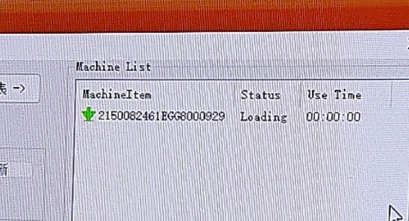

# 通过使能打开Telnet

打开“华为ONT维修使能工具V5”里的“华为ONT维修使能工具V5.exe”，确保光猫已经断开光纤且网口连接在了电脑上

选择“V3使能”（绝大多数HG8321R即使是被RMS了也依旧是V3版本且漏洞可用）点击下面的“启动”

然后再点右上角的“设备列表”，应该就会看到你的光猫了

等到进度跑到Success然后光猫所有的灯一起亮就可以拔电源重启进入Telnet了

重启之后使用[Putty](https://www.putty.org/)选择**Other:Telnet**连接到**192.168.1.1**

账号是root

密码是admin（这个不行的话就是adminHW）

输入 `su`  提权，然后再输入 `shell` 进到完整的 BusyBox 终端，这样就算是完成了