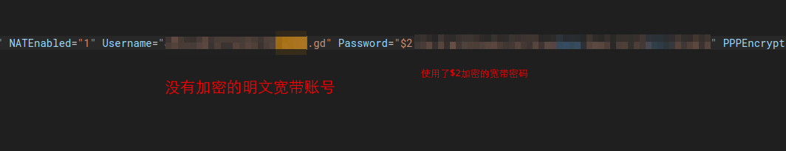
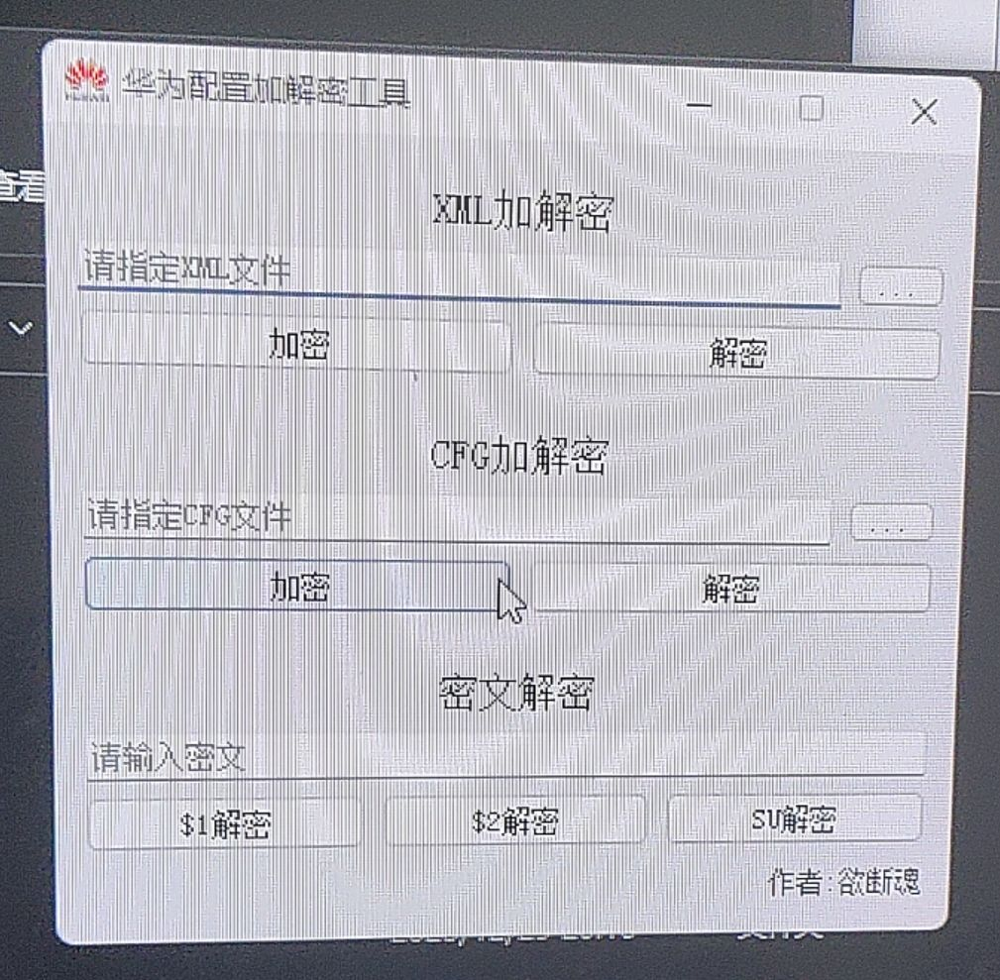
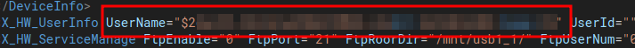

# 提取当前光猫的配置文件获取宽带账号密码和LOID

如果你之前有备份的话可以忽略这一步骤直接跳到[将运营商定制界面删除恢复为华为原版界面](recovery-huawei-ui.md)

但如果你像我一样没有备份LOID的话那么你需要通过Telnet提取，其重要性就不用我多说。

## 提取配置文件

打开“一键查询超密-必须在英文键盘下使用”下的"catmycfg.bat"

>**catmycfg.bat的行为解说**
>
>他会通过在本地生成一个临时的VBS脚本模拟键盘来替你终端输入命令，仅此而已
>
>担心有Back door的话可以直接查看里面的源码。

将cat出来的一大串配置文件备份好备用

或者你也可以在电脑上开一个TFTP服务，然后在光猫上把**mycfg.xml**传到你电脑上

## 获取宽带账号密码

打开"mycfg.xml"

使用你的文本编辑器搜索 `WANPPPConnectionInstance`

对于使用了$2或$1加密的文字（就是开头有$2或$1的），可以通过“huawei华为二次密码破解工具S1S2语音全鉴密码等.exe”进行解密

将整串文字复制到密文解密的框中解密即可

## 获取LOID

没有LOID的话WAN是没办法连接的。

使用你的文本编辑器搜索 `X_HW_UserInfo`

后面的 `UserName` 就是你的LOID了，还是一样，通过解密工具解密