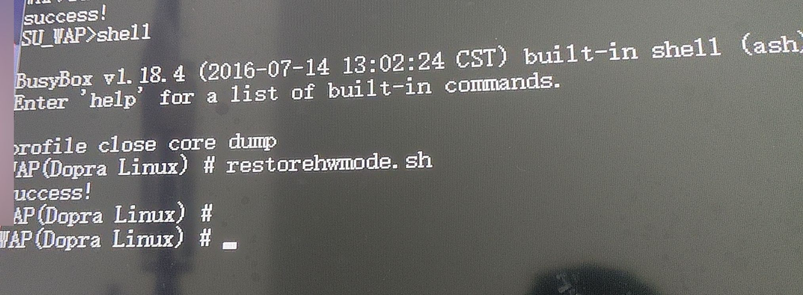
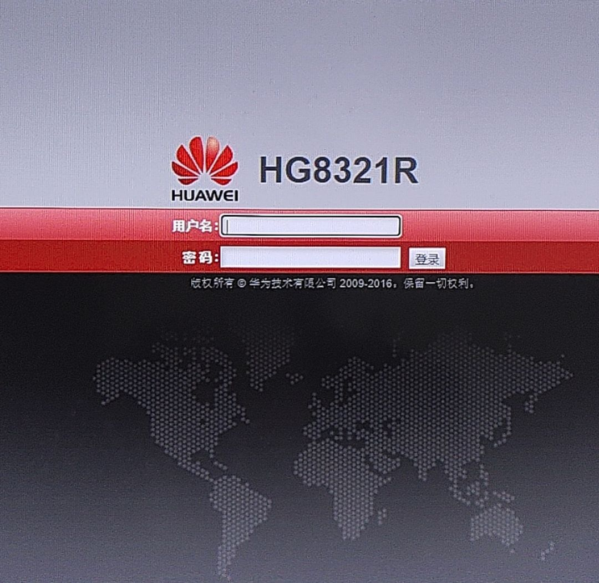
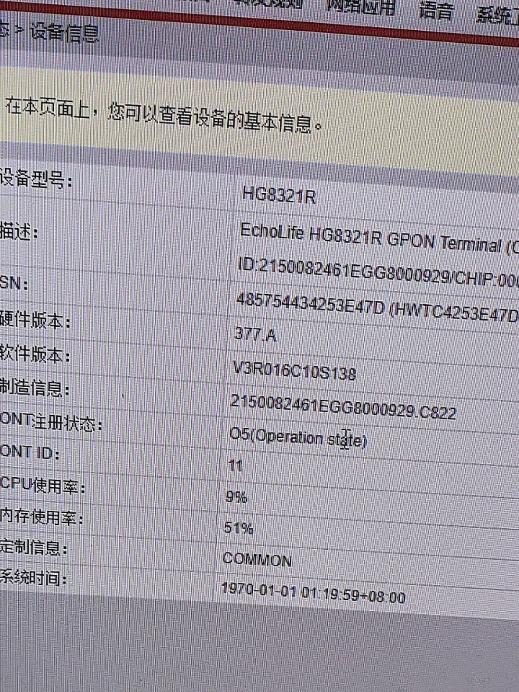
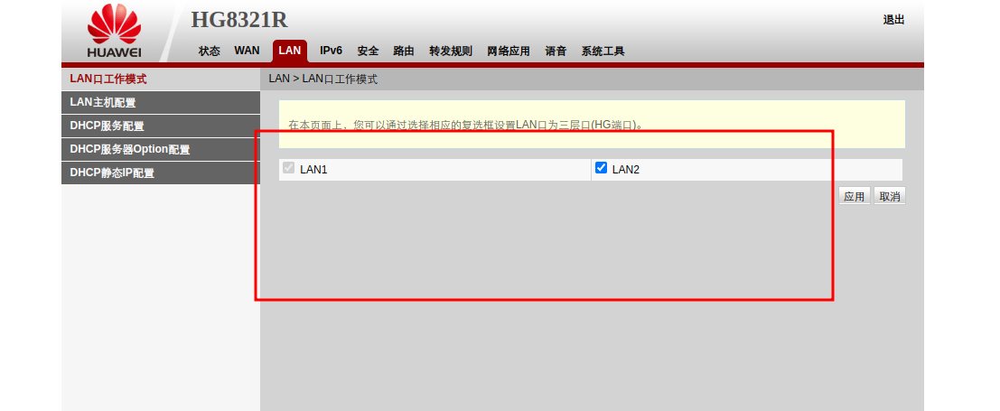
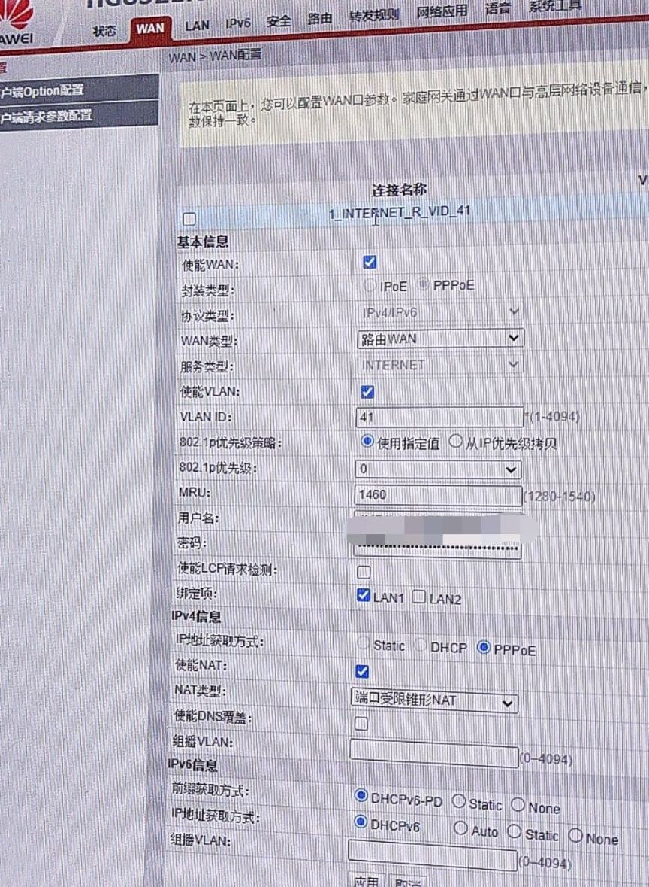

# 将运营商定制界面删除恢复为华为原版界面

**如果你在前面的教程中已经尝试过连接到光猫的Telnet请先关闭，因为光猫的Telnet被设置成了不允许多session**

> 输入 `su`  提权，然后再输入 `shell` 进到完整的 BusyBox 终端

然后输入 `restorehwmode.sh` （对它就是一个在 `/usr/bin/` 的二进制执行程序，天知道为什么会设置成这个名字）

出现 "success!" 后就可以拔掉电源重启了

然后将电脑网卡设置为静态IP`192.168.100.*`（*号可以为2到254任何一个数字），网关为`192.168.100.1`，子网掩码为`255.255.255.0`

然后在浏览器打开`192.168.100.1`应该就能看到登录界面了

默认超管账号为`telecomadmin`密码为`admintelecom`

## 通网

### 注册LOID

到 系统工具 > ONT认证

输入你的LOID和密码（没有密码的话就空着）

等待 首页 > 设备信息 的 "ONT注册状态" 变成O5 就注册成功了

### 新建连接

首先到 LAN 里启用两个 LAN 口（当然也不用两个都开启，看你的网线插在哪个口）

然后到 WAN 新建 INTERNET 连接，协议选IPv4/IPv6

如果你要桥接使用用路由器拨号就选“桥接WAN”填好VLAN ID保存配置就完事了（建议桥接拨号，可以避免运营商下发运营商的自治DNS和利用路由器性能跑满宽带）

如果你要这个小垃圾光猫负责拨号就选“路由WAN”然后填好宽带账号密码以及VLAN ID

大概就是这样配置

